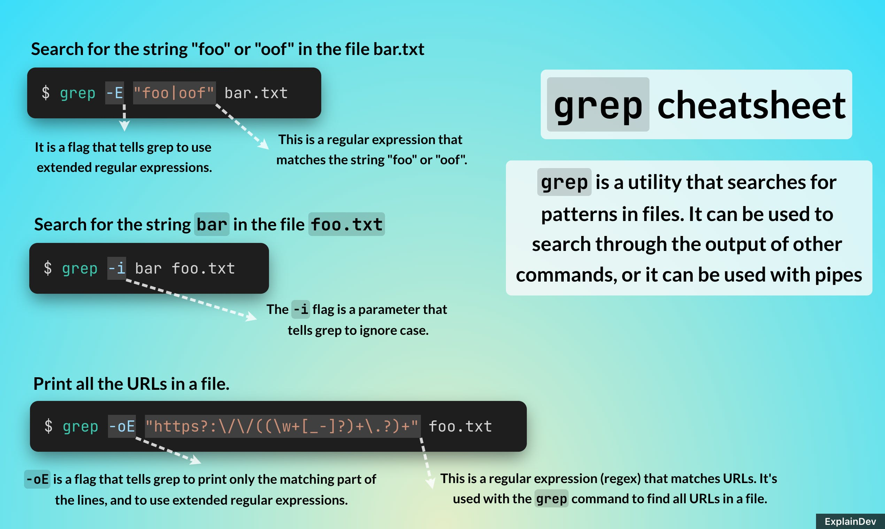
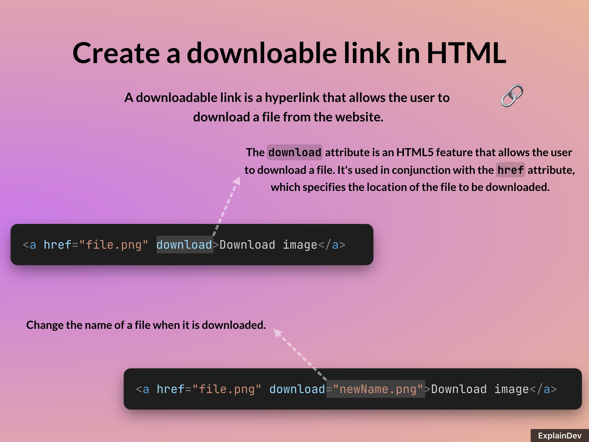

# ExplainDev Tutorial Maker

Instead of wasting time thinking of a better name, we use our time to make this awesome little project *opensource*.

Tutorial Maker helps you create those beautiful images of code people share on Internet, explained with AI.

## Demo

Demo video: [watch on YouTube](https://www.youtube.com/watch?v=LcKhSe0iVyA).

### Examples

Most text in the images below was written by AI.

#### Tutorial JavaScript

#### Tutorial grep

#### Tutorial HTML Links

#### Tutorial Docker containers

## Features

### 💥 Add code blocks and text elements

### 🤖 Explain code with AI

### 🖼️ Download tutorial as an png image

### ↔️ Resize, position and change color of elements

### 🌈 Custom background using plain CSS directives

### 🪄 Code Syntax Highlighting

## Development

This project was bootstrapped with [Create React App](https://github.com/facebook/create-react-app).

In the project directory, you can run:

### `npm start`

Runs the app in the development mode.

Open [http://localhost:3000](http://localhost:3000) to view it in the browser.

The page will reload if you make edits.
You will also see any lint errors in the console.

### `npm run build`

Builds the app for production to the `build` folder.
It correctly bundles React in production mode and optimizes the build for the best performance.

The build is minified and the filenames include the hashes.

## Contributing

Please, read our contributing guidelines and code of conduct.

## To-do list

### Decouple explanation boxes from ExplainDev service

Goal: Users should be able to highlight explain code without the help of AI.

AI explanations are awesome, but sometimes expensive, innacurate or simply unnecessary. We know some users would love to add explanations themselves. We believe that this feature should be optional.

### Testing

Goal: Develop a robust testing framework that prevents introducing breaking changes.

Tests weren't a priority in the MVP phase but we aspire to grow Tutorial Maker into a mature project. Ideas for testing the webapp are welcome.

### Store tutorials

Goal: Save tutorials so that you can recover them later.

Store tutorials in any storage. In order to make it happen, we'd need to serialize the state of the canvas and its elements, for example, the content of code blocks, position, colors, etc.

### Decouple login from ExplainDev service

Goal: Use any authentication provider

### Docs

Goal: make it easier for new folks to start contributing to this project

## Learn more

We’re welcoming everyone in our community to contribute to the tutorial maker and would love your input in whatever capacity you thrive in. I’ll be building out the contribution guidelines in the days to come in order to make it easier to get started. We welcome discussion on Discord!

* [Discord Community](https://discord.gg/JTU2v6TtPv)
* [Twitter](https://twitter.com/explain_dev)
* [YouTube](https://www.youtube.com/channel/UCO9-BA8YMaZG8qdHAVk0OOA/featured)